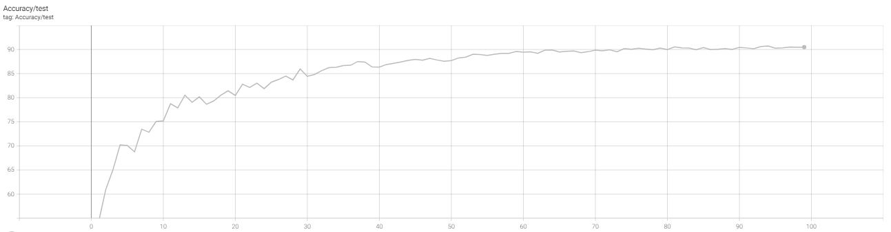
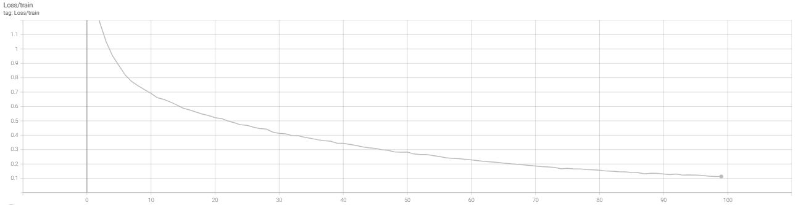

# Deep-Learning
Term Project for Deep Learning(2022)
Baseline Model : EfficientNet-B0 | Data Augmentation : Random-crop,horizontal-flip,(Cutmix-try) | Learning Rate Scheduling : Lambda-LR Scheduling(epoch: 0.95 ** epoch )
Best Accuracy : 90.74%

## Result_Accuracy/test

 

## Result_loss/train
